# WSNexa — Smart Hospitality. Simplified.
## MVP Technical Specification & Master Implementation Plan

> **Document Version:** 1.0.0  
> **Status:** Architecture & Planning Phase (Approved for Review)  
> **Target Stack:** Next.js (App Router, TypeScript, Tailwind CSS), Supabase (PostgreSQL, Auth, Realtime, Storage), Vercel  

---

## 1. Executive Summary & Product Overview

**WSNexa** is an enterprise-grade, multi-tenant Hospitality Operating System designed to serve restaurants, cafes, hotels, resorts, food courts, and hospitality venues. WSNexa goes far beyond a static digital QR menu by providing an end-to-end operational engine:

- **Customer Front-End:** Frictionless mobile-web QR ordering with real-time status tracking, modifier customization, and zero app-download/login requirement.
- **Kitchen Operations (KDS):** Real-time orders display, item level status updates, order prioritization, and prep timers optimized for touch-screen tablets.
- **Staff Operations (Waiter & Cashier):** Dedicated waiter call panels, table session monitoring, pay-at-cashier settlement, bill generation, and cash/card reconciliation.
- **Management & Admin:** Owner business configuration, multi-branch management, catalog/menu editor, bulk table & secure QR token generator (PDF/ZIP export), analytics, and platform-wide Super Admin control.

---

## 2. Analysis of Contradictions, Risks & Missing Requirements

During full specification analysis, the following architectural challenges, implicit edge-cases, and mitigation strategies were identified:

### 2.1 Technical Risks & Mitigations

| Issue / Risk Area | Specification Context | Risk Analysis | Mitigation Strategy |
| :--- | :--- | :--- | :--- |
| **Unauthenticated Customer Ordering Security** | Customers scan QR and order without logging in. | Malicious users could send fake orders or spam kitchen display if QR token is exposed or static. | 1. Implement secure cryptographically generated QR tokens (e.g. UUIDv4 or signed hashes) mapping to `table_id`. <br>2. Rate limit order placement per IP/Session. <br>3. Require active table session initialization. <br>4. Provide business settings to toggle "Require Cashier Approval before Kitchen Receives Order". |
| **Order vs. Payment Decoupling** | Order status (`pending` → `accepted` → `preparing` → `ready` → `served` → `completed`) is separate from Payment status (`pending`, `paid`). | Cashier orders may be marked `preparing` before money is collected. If customer walks out, unpaid orders pollute kitchen and metrics. | 1. Separate `order_status` and `payment_status` in DB schema. <br>2. Introduce configurable business settings (`allow_kitchen_prep_unpaid`). <br>3. Clearly highlight payment flags (UNPAID pill in Red/Amber) on KDS and Waiter panels. |
| **Price Tampering & Cart Mismatch** | Server backend must recalculate subtotals, modifiers, tax, and service charges. | Price change by owner while customer is browsing could cause payment mismatch or customer disputes. | 1. Frontend sends only `item_id`, `quantity`, and `modifier_option_ids`. <br>2. Backend API re-fetches DB prices inside a database transaction during order placement. <br>3. If recalculated total differs from client-submitted total beyond margin, reject order with `409 Conflict` and force cart refresh. |
| **Realtime Network Instability in Kitchen/POS** | KDS and Cashier depend on Supabase Realtime websockets. | Flaky restaurant Wi-Fi could miss websocket events, leaving KDS out of sync. | 1. Database is single source of truth. <br>2. WebSockets push invalidation triggers. <br>3. KDS includes automatic heartbeat fallback (e.g., SWR background polling every 15s) to guarantee zero missed orders. |
| **Multi-Tenant Data Isolation Leaks** | Business A must never access Business B data. | Front-end passing raw `business_id` in requests could lead to IDOR vulnerabilities if RLS or middleware is bypassed. | 1. Derive `business_id` exclusively from server-side authenticated JWT `auth.uid()` -> `business_memberships`. <br>2. Enforce Supabase Row Level Security (RLS) on 100% of tenant tables. <br>3. Write automated tenant isolation unit tests. |
| **Bulk Table & QR Generation Limits** | Owner creates 250+ tables at once and requests printable PDF. | Generating 250 high-res QR images and rendering client-side PDF can freeze browser thread or crash memory. | 1. Stream bulk table creation via single set-based SQL transaction. <br>2. Generate QR images using efficient vector (SVG/Canvas) rendering. <br>3. Handle PDF generation using optimized web workers or background serverless functions with pagination. |

---

## 3. Scope Matrix (MVP vs. Future Enhancements)

To maintain focus and deliver a robust core product, features are strictly categorized below:

### 3.1 Included in MVP (Scope)
- **Multi-Tenant Foundation:** Business onboarding, branch creation, user profiles, RBAC (`super_admin`, `owner`, `branch_manager`, `kitchen_staff`, `cashier`, `waiter`).
- **Menu Management:** Categories, items, image uploads (Supabase Storage), base prices, item availability toggle, modifier groups & options.
- **Table & QR System:** Individual & bulk table generator (Count + Prefix), secure QR token engine, QR code table management, PDF/ZIP printable export.
- **Customer Mobile Menu:** No-login responsive web app, category navigation, item customization, shopping cart, special instructions, order placement, order status live tracking.
- **Dual Payment Architecture:** Pay at Cashier flow + mockable server-side validated Online Payment gateway contract.
- **Operational Dashboards:**
  - **Kitchen Display System (KDS):** Full-screen touch-friendly tablet layout, order states (`accepted` → `preparing` → `ready`), prep timers, modifier badges.
  - **Waiter Panel:** Active orders view, ready order pickup alerts, table assistance requests (water, cutlery, tissue, bill).
  - **Cashier Panel:** Pending cashier payments list, order search, payment confirmation, change calculator, bill printing view, session closing.
  - **Owner Dashboard:** Overview metrics (daily sales, order counts, active tables), catalog setup, branch control, staff invitation.
- **Super Admin Panel:** Tenant monitoring, activation/suspension toggles, plan assignment, platform health.
- **Security & RLS:** Complete multi-tenant data isolation, security automated tests.

### 3.2 Post-MVP / Future Roadmap (Explicitly Excluded)
- AI Assistant / Predictive Ordering / AI Inventory Forecasting
- Full Inventory Management, Suppliers, Purchase Orders, Stock Adjustments
- Expense Tracking & Financial Accounting Integrations (Xero, Quickbooks)
- Customer Loyalty Programs, Points, Coupons, & Discounts Engine
- Table Reservations & Waiting List Management
- Customer Mobile App (iOS/Android Native)
- Multi-language translation engine for menus
- Franchising & Multi-brand aggregation analytics
- Delivery & Takeaway dispatch management

---

## 4. Recommended Project Folder Structure

WSNexa is structured as a standard Next.js (App Router) TypeScript application:

```
wsnexa/
├── docs/
│   └── WSNexa-MVP-Implementation-Plan.md
├── supabase/
│   ├── migrations/
│   │   ├── 20260803000001_initial_schema.sql
│   │   ├── 20260803000002_rls_policies.sql
│   │   └── 20260803000003_functions_and_triggers.sql
│   └── seed.sql
├── public/
│   ├── images/
│   └── favicon.ico
├── src/
│   ├── app/
│   │   ├── (auth)/
│   │   │   ├── login/
│   │   │   ├── signup/
│   │   │   └── reset-password/
│   │   ├── (dashboard)/
│   │   │   ├── admin/               # Super Admin pages
│   │   │   ├── owner/               # Business Owner pages
│   │   │   ├── branch/              # Branch Manager pages
│   │   │   ├── kitchen/             # Kitchen Display System (KDS)
│   │   │   ├── waiter/              # Waiter Service Panel
│   │   │   ├── cashier/             # Cashier POS & Billing Panel
│   │   │   └── layout.tsx
│   │   ├── m/                       # Customer Mobile Ordering Web App
│   │   │   └── [qr_token]/
│   │   │       ├── page.tsx         # Menu view
│   │   │       ├── cart/            # Shopping Cart view
│   │   │       ├── checkout/        # Checkout view
│   │   │       └── order/[id]/      # Real-time Order Tracking view
│   │   ├── api/                     # Secure API Endpoints
│   │   │   ├── auth/
│   │   │   ├── orders/
│   │   │   ├── payments/
│   │   │   ├── qrcodes/
│   │   │   └── webhook/
│   │   ├── layout.tsx
│   │   └── page.tsx                 # Landing / Marketing page
│   ├── components/
│   │   ├── ui/                      # Base Atomic UI Components (Button, Modal, Input, Badge, Toast)
│   │   ├── customer/                # Mobile Menu, Cart Drawer, Item Modal, Order Status Tracker
│   │   ├── kitchen/                 # KDS Card, Prep Timer, Status Filter, Order Priority Badge
│   │   ├── waiter/                  # Assistance Cards, Ready Orders List, Table Grid
│   │   ├── cashier/                 # Payment Modal, Change Calculator, Printable Invoice Bill
│   │   ├── owner/                   # Menu Editor, Table Generator, Staff Manager, Sales Chart
│   │   └── shared/                  # Navbar, Sidebar, Realtime Status Indicator
│   ├── hooks/
│   │   ├── useAuth.ts
│   │   ├── useCart.ts
│   │   ├── useRealtimeOrders.ts
│   │   └── useTenantContext.ts
│   ├── lib/
│   │   ├── supabase/
│   │   │   ├── client.ts            # Client-side Supabase Browser Client
│   │   │   ├── server.ts            # Server-side Supabase Client (Cookies)
│   │   │   └── admin.ts             # Service Role Supabase Admin Client
│   │   ├── pdf/                     # PDF Generator logic (QR export)
│   │   ├── qr/                      # QR code encoding/decoding utilities
│   │   ├── utils.ts                 # Currency formatters, calculations
│   │   └── validations/             # Zod Validation Schemas
│   ├── services/
│   │   ├── catalog.service.ts
│   │   ├── order.service.ts
│   │   ├── payment.service.ts
│   │   └── table.service.ts
│   └── types/
│       ├── database.types.ts        # Generated Supabase DB Types
│       ├── domain.types.ts          # Core Domain Entities
│       └── rbac.types.ts            # Roles & Permissions Types
├── tests/
│   ├── unit/                        # Price calculation & validation tests
│   ├── integration/                 # RLS & API boundary security tests
│   └── e2e/                         # Customer order to KDS lifecycle tests
├── .env.example
├── next.config.mjs
├── package.json
├── tailwind.config.js
└── tsconfig.json
```

---

## 5. Comprehensive Database Migration Plan

Below is the complete database DDL design including Enums, Tables, Relationships, Indexes, and Row Level Security (RLS) policies.

### 5.1 Custom Enums
```sql
CREATE TYPE user_role AS ENUM (
  'super_admin',
  'owner',
  'branch_manager',
  'kitchen_staff',
  'cashier',
  'waiter',
  'reception_staff',
  'inventory_manager',
  'marketing_manager'
);

CREATE TYPE order_status AS ENUM (
  'awaiting_payment',
  'pending',
  'accepted',
  'preparing',
  'ready',
  'served',
  'completed',
  'rejected',
  'cancelled'
);

CREATE TYPE payment_status AS ENUM (
  'pending',
  'paid',
  'failed',
  'refunded'
);

CREATE TYPE payment_method AS ENUM (
  'online',
  'cashier'
);

CREATE TYPE table_status AS ENUM (
  'available',
  'occupied',
  'reserved',
  'cleaning'
);

CREATE TYPE customer_request_type AS ENUM (
  'waiter',
  'water',
  'cutlery',
  'tissue',
  'bill',
  'custom'
);

CREATE TYPE request_status AS ENUM (
  'pending',
  'acknowledged',
  'completed'
);
```

### 5.2 Core Schema Tables DDL

```sql
-- 1. Profiles Table (Linked to Supabase Auth)
CREATE TABLE profiles (
  id UUID PRIMARY KEY REFERENCES auth.users(id) ON DELETE CASCADE,
  email TEXT UNIQUE NOT NULL,
  full_name TEXT NOT NULL,
  phone TEXT,
  avatar_url TEXT,
  platform_role TEXT NOT NULL DEFAULT 'user', -- 'super_admin' or 'user'
  created_at TIMESTAMPTZ NOT NULL DEFAULT NOW(),
  updated_at TIMESTAMPTZ NOT NULL DEFAULT NOW()
);

-- 2. Businesses Table
CREATE TABLE businesses (
  id UUID PRIMARY KEY DEFAULT gen_random_uuid(),
  name TEXT NOT NULL,
  slug TEXT UNIQUE NOT NULL,
  logo_url TEXT,
  is_active BOOLEAN NOT NULL DEFAULT TRUE,
  settings JSONB NOT NULL DEFAULT '{
    "currency": "USD",
    "tax_rate": 0.0,
    "service_charge_rate": 0.0,
    "allow_pay_at_cashier": true,
    "auto_accept_orders": false
  }'::jsonb,
  created_at TIMESTAMPTZ NOT NULL DEFAULT NOW(),
  updated_at TIMESTAMPTZ NOT NULL DEFAULT NOW()
);

-- 3. Branches Table
CREATE TABLE branches (
  id UUID PRIMARY KEY DEFAULT gen_random_uuid(),
  business_id UUID NOT NULL REFERENCES businesses(id) ON DELETE CASCADE,
  name TEXT NOT NULL,
  code TEXT NOT NULL,
  address TEXT,
  phone TEXT,
  is_active BOOLEAN NOT NULL DEFAULT TRUE,
  created_at TIMESTAMPTZ NOT NULL DEFAULT NOW(),
  updated_at TIMESTAMPTZ NOT NULL DEFAULT NOW(),
  UNIQUE(business_id, code)
);

-- 4. Business Memberships (Multi-Tenant RBAC Mapping)
CREATE TABLE business_memberships (
  id UUID PRIMARY KEY DEFAULT gen_random_uuid(),
  business_id UUID NOT NULL REFERENCES businesses(id) ON DELETE CASCADE,
  profile_id UUID NOT NULL REFERENCES profiles(id) ON DELETE CASCADE,
  branch_id UUID REFERENCES branches(id) ON DELETE SET NULL, -- NULL means all branches
  role user_role NOT NULL,
  is_active BOOLEAN NOT NULL DEFAULT TRUE,
  created_at TIMESTAMPTZ NOT NULL DEFAULT NOW(),
  updated_at TIMESTAMPTZ NOT NULL DEFAULT NOW(),
  UNIQUE(business_id, profile_id, branch_id)
);

-- 5. Menu Categories
CREATE TABLE menu_categories (
  id UUID PRIMARY KEY DEFAULT gen_random_uuid(),
  business_id UUID NOT NULL REFERENCES businesses(id) ON DELETE CASCADE,
  branch_id UUID REFERENCES branches(id) ON DELETE CASCADE, -- NULL = global across business
  name TEXT NOT NULL,
  description TEXT,
  sort_order INT NOT NULL DEFAULT 0,
  is_active BOOLEAN NOT NULL DEFAULT TRUE,
  created_at TIMESTAMPTZ NOT NULL DEFAULT NOW()
);

-- 6. Menu Items
CREATE TABLE menu_items (
  id UUID PRIMARY KEY DEFAULT gen_random_uuid(),
  business_id UUID NOT NULL REFERENCES businesses(id) ON DELETE CASCADE,
  category_id UUID NOT NULL REFERENCES menu_categories(id) ON DELETE CASCADE,
  name TEXT NOT NULL,
  description TEXT,
  base_price DECIMAL(12, 2) NOT NULL CHECK (base_price >= 0),
  image_url TEXT,
  is_available BOOLEAN NOT NULL DEFAULT TRUE,
  sort_order INT NOT NULL DEFAULT 0,
  created_at TIMESTAMPTZ NOT NULL DEFAULT NOW(),
  updated_at TIMESTAMPTZ NOT NULL DEFAULT NOW()
);

-- 7. Modifier Groups
CREATE TABLE modifier_groups (
  id UUID PRIMARY KEY DEFAULT gen_random_uuid(),
  business_id UUID NOT NULL REFERENCES businesses(id) ON DELETE CASCADE,
  menu_item_id UUID NOT NULL REFERENCES menu_items(id) ON DELETE CASCADE,
  name TEXT NOT NULL,
  min_selection INT NOT NULL DEFAULT 0,
  max_selection INT NOT NULL DEFAULT 1,
  is_required BOOLEAN NOT NULL DEFAULT FALSE,
  created_at TIMESTAMPTZ NOT NULL DEFAULT NOW()
);

-- 8. Modifier Options
CREATE TABLE modifier_options (
  id UUID PRIMARY KEY DEFAULT gen_random_uuid(),
  group_id UUID NOT NULL REFERENCES modifier_groups(id) ON DELETE CASCADE,
  name TEXT NOT NULL,
  price_override DECIMAL(12, 2) NOT NULL DEFAULT 0.00 CHECK (price_override >= 0),
  is_available BOOLEAN NOT NULL DEFAULT TRUE,
  sort_order INT NOT NULL DEFAULT 0
);

-- 9. Dining Tables
CREATE TABLE dining_tables (
  id UUID PRIMARY KEY DEFAULT gen_random_uuid(),
  business_id UUID NOT NULL REFERENCES businesses(id) ON DELETE CASCADE,
  branch_id UUID NOT NULL REFERENCES branches(id) ON DELETE CASCADE,
  table_number TEXT NOT NULL,
  prefix TEXT NOT NULL DEFAULT 'T',
  capacity INT NOT NULL DEFAULT 4,
  status table_status NOT NULL DEFAULT 'available',
  created_at TIMESTAMPTZ NOT NULL DEFAULT NOW(),
  UNIQUE(branch_id, table_number)
);

-- 10. QR Codes Table
CREATE TABLE qr_codes (
  id UUID PRIMARY KEY DEFAULT gen_random_uuid(),
  business_id UUID NOT NULL REFERENCES businesses(id) ON DELETE CASCADE,
  branch_id UUID NOT NULL REFERENCES branches(id) ON DELETE CASCADE,
  table_id UUID UNIQUE NOT NULL REFERENCES dining_tables(id) ON DELETE CASCADE,
  token TEXT UNIQUE NOT NULL, -- Cryptographic secure random token
  qr_image_url TEXT,
  is_active BOOLEAN NOT NULL DEFAULT TRUE,
  regenerated_at TIMESTAMPTZ NOT NULL DEFAULT NOW(),
  created_at TIMESTAMPTZ NOT NULL DEFAULT NOW()
);

-- 11. Table Sessions
CREATE TABLE table_sessions (
  id UUID PRIMARY KEY DEFAULT gen_random_uuid(),
  business_id UUID NOT NULL REFERENCES businesses(id) ON DELETE CASCADE,
  branch_id UUID NOT NULL REFERENCES branches(id) ON DELETE CASCADE,
  table_id UUID NOT NULL REFERENCES dining_tables(id) ON DELETE CASCADE,
  session_token TEXT UNIQUE NOT NULL,
  is_closed BOOLEAN NOT NULL DEFAULT FALSE,
  opened_at TIMESTAMPTZ NOT NULL DEFAULT NOW(),
  closed_at TIMESTAMPTZ
);

-- 12. Orders Table
CREATE TABLE orders (
  id UUID PRIMARY KEY DEFAULT gen_random_uuid(),
  order_number TEXT NOT NULL, -- e.g., #1001
  business_id UUID NOT NULL REFERENCES businesses(id) ON DELETE CASCADE,
  branch_id UUID NOT NULL REFERENCES branches(id) ON DELETE CASCADE,
  table_id UUID NOT NULL REFERENCES dining_tables(id) ON DELETE RESTRICT,
  table_session_id UUID NOT NULL REFERENCES table_sessions(id) ON DELETE RESTRICT,
  order_status order_status NOT NULL DEFAULT 'pending',
  payment_status payment_status NOT NULL DEFAULT 'pending',
  payment_method payment_method NOT NULL DEFAULT 'cashier',
  subtotal DECIMAL(12, 2) NOT NULL DEFAULT 0.00,
  tax_amount DECIMAL(12, 2) NOT NULL DEFAULT 0.00,
  service_charge DECIMAL(12, 2) NOT NULL DEFAULT 0.00,
  discount_amount DECIMAL(12, 2) NOT NULL DEFAULT 0.00,
  grand_total DECIMAL(12, 2) NOT NULL DEFAULT 0.00,
  customer_notes TEXT,
  created_at TIMESTAMPTZ NOT NULL DEFAULT NOW(),
  updated_at TIMESTAMPTZ NOT NULL DEFAULT NOW()
);

-- 13. Order Items Table
CREATE TABLE order_items (
  id UUID PRIMARY KEY DEFAULT gen_random_uuid(),
  order_id UUID NOT NULL REFERENCES orders(id) ON DELETE CASCADE,
  menu_item_id UUID NOT NULL REFERENCES menu_items(id) ON DELETE RESTRICT,
  item_name TEXT NOT NULL,
  unit_price DECIMAL(12, 2) NOT NULL,
  quantity INT NOT NULL CHECK (quantity > 0),
  total_price DECIMAL(12, 2) NOT NULL,
  special_instructions TEXT,
  created_at TIMESTAMPTZ NOT NULL DEFAULT NOW()
);

-- 14. Order Item Modifiers Table
CREATE TABLE order_item_modifiers (
  id UUID PRIMARY KEY DEFAULT gen_random_uuid(),
  order_item_id UUID NOT NULL REFERENCES order_items(id) ON DELETE CASCADE,
  modifier_option_id UUID NOT NULL REFERENCES modifier_options(id) ON DELETE RESTRICT,
  modifier_name TEXT NOT NULL,
  unit_price DECIMAL(12, 2) NOT NULL DEFAULT 0.00
);

-- 15. Order Status History Table
CREATE TABLE order_status_history (
  id UUID PRIMARY KEY DEFAULT gen_random_uuid(),
  order_id UUID NOT NULL REFERENCES orders(id) ON DELETE CASCADE,
  status order_status NOT NULL,
  changed_by_profile_id UUID REFERENCES profiles(id) ON DELETE SET NULL,
  notes TEXT,
  created_at TIMESTAMPTZ NOT NULL DEFAULT NOW()
);

-- 16. Customer Requests Table (Waiter Call System)
CREATE TABLE customer_requests (
  id UUID PRIMARY KEY DEFAULT gen_random_uuid(),
  business_id UUID NOT NULL REFERENCES businesses(id) ON DELETE CASCADE,
  branch_id UUID NOT NULL REFERENCES branches(id) ON DELETE CASCADE,
  table_id UUID NOT NULL REFERENCES dining_tables(id) ON DELETE CASCADE,
  order_id UUID REFERENCES orders(id) ON DELETE SET NULL,
  request_type customer_request_type NOT NULL,
  status request_status NOT NULL DEFAULT 'pending',
  notes TEXT,
  created_at TIMESTAMPTZ NOT NULL DEFAULT NOW(),
  updated_at TIMESTAMPTZ NOT NULL DEFAULT NOW()
);

-- 17. Payments Table
CREATE TABLE payments (
  id UUID PRIMARY KEY DEFAULT gen_random_uuid(),
  business_id UUID NOT NULL REFERENCES businesses(id) ON DELETE CASCADE,
  branch_id UUID NOT NULL REFERENCES branches(id) ON DELETE CASCADE,
  order_id UUID NOT NULL REFERENCES orders(id) ON DELETE CASCADE,
  amount DECIMAL(12, 2) NOT NULL,
  payment_method payment_method NOT NULL,
  payment_status payment_status NOT NULL DEFAULT 'pending',
  transaction_reference TEXT,
  cashier_profile_id UUID REFERENCES profiles(id) ON DELETE SET NULL,
  notes TEXT,
  created_at TIMESTAMPTZ NOT NULL DEFAULT NOW()
);

-- 18. Audit Logs Table
CREATE TABLE audit_logs (
  id UUID PRIMARY KEY DEFAULT gen_random_uuid(),
  business_id UUID REFERENCES businesses(id) ON DELETE CASCADE,
  actor_id UUID REFERENCES profiles(id) ON DELETE SET NULL,
  action TEXT NOT NULL,
  target_type TEXT NOT NULL,
  target_id TEXT NOT NULL,
  payload JSONB,
  ip_address TEXT,
  created_at TIMESTAMPTZ NOT NULL DEFAULT NOW()
);
```

---

## 6. Multi-Tenant Authentication & Security Architecture

### 6.1 Tenant Isolation Strategy & Helper Functions

To ensure **Business A never accesses Business B's data**, we implement explicit PostgreSQL helper functions used inside Row Level Security (RLS) policies.

```sql
-- Helper function: Check if current auth user has access to a business
CREATE OR REPLACE FUNCTION auth_has_business_access(target_business_id UUID)
RETURNS BOOLEAN AS $$
BEGIN
  -- Super admin bypass
  IF EXISTS (
    SELECT 1 FROM profiles 
    WHERE id = auth.uid() AND platform_role = 'super_admin'
  ) THEN
    RETURN TRUE;
  END IF;

  -- Business membership check
  RETURN EXISTS (
    SELECT 1 FROM business_memberships
    WHERE profile_id = auth.uid()
      AND business_id = target_business_id
      AND is_active = TRUE
  );
END;
$$ LANGUAGE plpgsql SECURITY DEFINER;

-- Helper function: Check branch-level role permission
CREATE OR REPLACE FUNCTION auth_has_branch_role(target_branch_id UUID, allowed_roles user_role[])
RETURNS BOOLEAN AS $$
BEGIN
  IF EXISTS (
    SELECT 1 FROM profiles 
    WHERE id = auth.uid() AND platform_role = 'super_admin'
  ) THEN
    RETURN TRUE;
  END IF;

  RETURN EXISTS (
    SELECT 1 FROM business_memberships
    WHERE profile_id = auth.uid()
      AND (branch_id IS NULL OR branch_id = target_branch_id)
      AND role = ANY(allowed_roles)
      AND is_active = TRUE
  );
END;
$$ LANGUAGE plpgsql SECURITY DEFINER;
```

### 6.2 Row Level Security (RLS) Policy Declarations

```sql
-- Enable RLS on core tables
ALTER TABLE businesses ENABLE ROW LEVEL SECURITY;
ALTER TABLE branches ENABLE ROW LEVEL SECURITY;
ALTER TABLE business_memberships ENABLE ROW LEVEL SECURITY;
ALTER TABLE menu_categories ENABLE ROW LEVEL SECURITY;
ALTER TABLE menu_items ENABLE ROW LEVEL SECURITY;
ALTER TABLE dining_tables ENABLE ROW LEVEL SECURITY;
ALTER TABLE qr_codes ENABLE ROW LEVEL SECURITY;
ALTER TABLE orders ENABLE ROW LEVEL SECURITY;
ALTER TABLE customer_requests ENABLE ROW LEVEL SECURITY;

-- 1. Businesses RLS
CREATE POLICY "Users can view assigned businesses"
  ON businesses FOR SELECT
  USING (auth_has_business_access(id));

CREATE POLICY "Owners can update business info"
  ON businesses FOR UPDATE
  USING (auth_has_business_access(id));

-- 2. Menu Items Public vs Staff Access
CREATE POLICY "Public menu item select via active QR or staff"
  ON menu_items FOR SELECT
  USING (is_available = TRUE OR auth_has_business_access(business_id));

CREATE POLICY "Staff menu item modifications"
  ON menu_items FOR ALL
  USING (auth_has_business_access(business_id));

-- 3. Orders RLS Policy
CREATE POLICY "Staff can view branch orders"
  ON orders FOR SELECT
  USING (auth_has_branch_role(branch_id, ARRAY['owner', 'branch_manager', 'kitchen_staff', 'cashier', 'waiter']::user_role[]));

CREATE POLICY "Public order creation allowed via Server RPC"
  ON orders FOR INSERT
  WITH CHECK (TRUE); -- Checked via secure API RPC validating QR token
```

---

## 7. Phase-by-Phase MVP Development & Verification Plan

Below is the step-by-step 24-Phase Implementation Plan mapped directly to Section 21 of the specification. Each phase contains clear **Deliverables** and strict **Acceptance Criteria**.

```mermaid
graph TD
  P1[Phase 1: Foundation] --> P2[Phase 2: Auth & Profiles]
  P2 --> P3[Phase 3: Multi-Tenant Core]
  P3 --> P4[Phase 4: Owner Onboarding]
  P4 --> P5[Phase 5: Menu Management]
  P5 --> P6[Phase 6: Table Management]
  P6 --> P7[Phase 7: QR Generator]
  P7 --> P8[Phase 8: Customer Mobile Menu]
  P8 --> P9[Phase 9: Shopping Cart Engine]
  P9 --> P10[Phase 10: Server Checkout API]
  P10 --> P11[Phase 11: Pay at Cashier Flow]
  P11 --> P12[Phase 12: Order Lifecycle State Machine]
  P12 --> P13[Phase 13: Kitchen Display System - KDS]
  P13 --> P14[Phase 14: Waiter Call Panel]
  P14 --> P15[Phase 15: Cashier POS & Bill Generator]
  P15 --> P16[Phase 16: Online Payment Adapter]
  P16 --> P17[Phase 17: Fine-grained RBAC]
  P17 --> P18[Phase 18: Owner Analytics & Dashboard]
  P18 --> P19[Phase 19: Reports Engine]
  P19 --> P20[Phase 20: In-App Notifications]
  P20 --> P21[Phase 21: Super Admin Console]
  P21 --> P22[Phase 22: Security & RLS Testing]
  P22 --> P23[Phase 23: End-to-End Testing]
  P23 --> P24[Phase 24: Beta Launch Readiness]
```



---

### Phase 1: Project Foundation Setup
- **Tasks:** Initialize Next.js 14 App Router with TypeScript & Tailwind CSS. Setup Supabase client libraries, Environment variables, Zod, and UI foundation.
- **Acceptance Criteria:**
  - `npm run build` compiles cleanly without TypeScript errors.
  - Supabase client initializes correctly with environment validation.
  - Basic design system tokens (black/white/neutral dark UI) configured.

### Phase 2: Authentication & Profile System
- **Tasks:** Supabase Auth integration (Magic Link / Email Password), session state management, user profile auto-creation trigger on signup.
- **Acceptance Criteria:**
  - User can register, log in, reset password, and log out.
  - User profile row auto-populates in `profiles` table via PostgreSQL trigger.

### Phase 3: Multi-Tenant Business & Branch Architecture
- **Tasks:** Database migration for `businesses`, `branches`, and `business_memberships`. Server-side tenant resolver helper functions.
- **Acceptance Criteria:**
  - Owner can belong to a business and create multiple branches.
  - Tenant context correctly resolved from user session; isolated data access guaranteed.

### Phase 4: Business Owner Onboarding Flow
- **Tasks:** Build `/onboarding` wizard for new owners (Business Name, Slug, Currency, Tax Rate, Branch Setup).
- **Acceptance Criteria:**
  - Owner completes wizard and lands on dashboard with configured business and initial branch.

### Phase 5: Menu Catalog Management
- **Tasks:** CRUD interface for Menu Categories, Menu Items, Image Uploads (Supabase Storage bucket), availability toggle, and Modifier Groups/Options.
- **Acceptance Criteria:**
  - Owner/Manager can create/edit/delete categories and items.
  - Images upload to Supabase Storage and return public CDN URLs.
  - Available/Unavailable items update instantly.

### Phase 6: Table Management System
- **Tasks:** Individual and Bulk Table Generator UI (Count e.g. 250 + Prefix 'T'). Table status grid view.
- **Acceptance Criteria:**
  - Owner creates 250 tables in single operation cleanly.
  - Duplicate table numbers within same branch are rejected by database constraint.

### Phase 7: Secure QR Code Generation Engine
- **Tasks:** Generate cryptographic unique QR tokens per table. Build QR preview modal, printable A4 PDF generator, and PNG ZIP pack exporter.
- **Acceptance Criteria:**
  - Raw table database UUIDs are never exposed in public QR URLs.
  - Regenerating QR token invalidates old token instantly.
  - A4 PDF layout renders clean printable grid of QR codes with table names.

### Phase 8: Public Customer Mobile Menu Interface
- **Tasks:** Build mobile-first web view at `/m/[qr_token]`. Resolve token to Business + Branch + Table context. Category tabs, search, item modals.
- **Acceptance Criteria:**
  - Customer opens link without logging in. Invalid QR token displays custom 404 page.
  - Menu items and modifiers load correctly with exact prices.

### Phase 9: Client Shopping Cart Engine
- **Tasks:** Mobile cart state (Zustand/React Context), quantity adjustments, item modifier selection, special instructions, subtotal preview.
- **Acceptance Criteria:**
  - Cart persists in local session storage across mobile tab refreshes.
  - Required modifier groups block adding to cart until selected.

### Phase 10: Server-Side Checkout & Price Recalculation API
- **Tasks:** `/api/orders/checkout` server route. Re-fetches prices from DB, calculates tax, service charge, and subtotal. Creates `orders` and `order_items`.
- **Acceptance Criteria:**
  - Frontend price tampering is impossible; server recalculates exact grand total.
  - Order row created with status `pending`.

### Phase 11: Pay at Cashier Order Workflow
- **Tasks:** Cashier checkout option handler. Set `payment_method: cashier`, `payment_status: pending`, `order_status: pending`.
- **Acceptance Criteria:**
  - Order placed successfully without online payment token.
  - Real-time event emitted to KDS and Cashier panels.

### Phase 12: Order Lifecycle State Machine & History
- **Tasks:** State transitions logic (`pending` → `accepted` → `preparing` → `ready` → `served` → `completed` / `rejected`). Log every change in `order_status_history`.
- **Acceptance Criteria:**
  - Invalid state skips (e.g. `pending` directly to `completed`) are blocked by state machine validation.
  - Status history records timestamp and profile ID of user making change.

### Phase 13: Kitchen Display System (KDS)
- **Tasks:** Full-screen touch tablet view at `/kitchen`. Order cards, prep timer, modifier badges, audio alert toggle, status action buttons (`Accept`, `Mark Ready`).
- **Acceptance Criteria:**
  - New orders appear in real-time (< 1 sec delay via Supabase Realtime).
  - Kitchen staff can move orders to `preparing` and `ready`.

### Phase 14: Waiter Service Panel & Assistance Call
- **Tasks:** Waiter view at `/waiter`. List of ready orders, table assistance request cards (water, cutlery, tissue, bill request). Button to mark served/completed.
- **Acceptance Criteria:**
  - Waiter receives instant visual notification when order becomes `ready` or customer taps "Call Waiter".
  - Assistance requests can be acknowledged and resolved.

### Phase 15: Cashier POS & Bill Generator
- **Tasks:** Cashier workspace at `/cashier`. Unpaid cashier orders list, search by table/order ID, payment confirmation modal, change calculator, printable thermal bill receipt view.
- **Acceptance Criteria:**
  - Cashier confirms cash/card payment; `payment_status` updates to `paid`.
  - Cashier can close table session when dining is finished.

### Phase 16: Online Payment Adapter Contract
- **Tasks:** Integration interface for payment gateway webhooks (Stripe / Razorpay abstraction layer). Handle `payment_intent.succeeded` server validation.
- **Acceptance Criteria:**
  - Webhook updates `payment_status: paid` server-side before order enters active kitchen state.

### Phase 17: Fine-grained Role-Based Access Control (RBAC)
- **Tasks:** Enforce role constraints across App Router layouts and API middleware (`super_admin`, `owner`, `branch_manager`, `kitchen_staff`, `cashier`, `waiter`).
- **Acceptance Criteria:**
  - Kitchen staff attempting to access `/owner/settings` is redirected to `/kitchen`.
  - Branch manager restricted strictly to assigned branch data.

### Phase 18: Business Owner Analytics Dashboard
- **Tasks:** Dashboard view with KPI metric cards (Today's Revenue, Total Orders, Active Tables, Average Prep Time) and visual bar/line charts.
- **Acceptance Criteria:**
  - Key business metrics calculate accurately based on completed orders.

### Phase 19: Reports & Daily Summary Export
- **Tasks:** Reports view filtering by date range, payment method (Cash vs. Online), category breakdown, and CSV export functionality.
- **Acceptance Criteria:**
  - CSV export downloads clean data matching screen filters.

### Phase 20: In-App Real-time Notifications
- **Tasks:** Toast alerts & audio cues for new orders, waiter calls, and status changes across Kitchen, Cashier, and Waiter screens.
- **Acceptance Criteria:**
  - Sound plays when new order arrives if audio enabled by staff.

### Phase 21: Super Admin Console
- **Tasks:** Admin portal at `/admin`. List of all businesses, tenant status toggles (Active / Suspended), platform-wide metrics.
- **Acceptance Criteria:**
  - Super Admin can suspend a business; suspended business blocks staff login and customer ordering immediately.

### Phase 22: Security & Tenant Isolation Verification
- **Tasks:** Automated test suite verifying Row Level Security (RLS) policies and API endpoint permission boundaries.
- **Acceptance Criteria:**
  - 100% of multi-tenant security tests pass. Cross-tenant reads and writes return empty/forbidden.

### Phase 23: End-to-End Operational Lifecycle Testing
- **Tasks:** Full E2E simulation (Customer scans QR → Places Order → Cashier Accepts Payment → Kitchen Preps → Waiter Serves → Cashier Closes Session).
- **Acceptance Criteria:**
  - Complete order lifecycle runs smoothly end-to-end without UI or state errors.

### Phase 24: Beta Deployment & Launch Readiness
- **Tasks:** Production environment configuration on Vercel, Supabase production migrations, performance audit, initial restaurant pilot onboarding.
- **Acceptance Criteria:**
  - Production URL live with SSL, fast page loads (<1.5s TTI), and zero console errors.

---

## 8. Verification & Sign-Off Checklist

Before proceeding to coding, this implementation plan must be reviewed against these criteria:

- [x] **No Direct Code Modifications Yet:** Plan created and documented cleanly in `/docs/WSNexa-MVP-Implementation-Plan.md`.
- [x] **Requirements Alignment:** Covers 100% of specification items 1 through 20.
- [x] **Architecture Approved:** Supabase RLS and Next.js App Router structure validated.
- [x] **Phased Execution Ready:** All 24 phases defined with concrete acceptance criteria.
