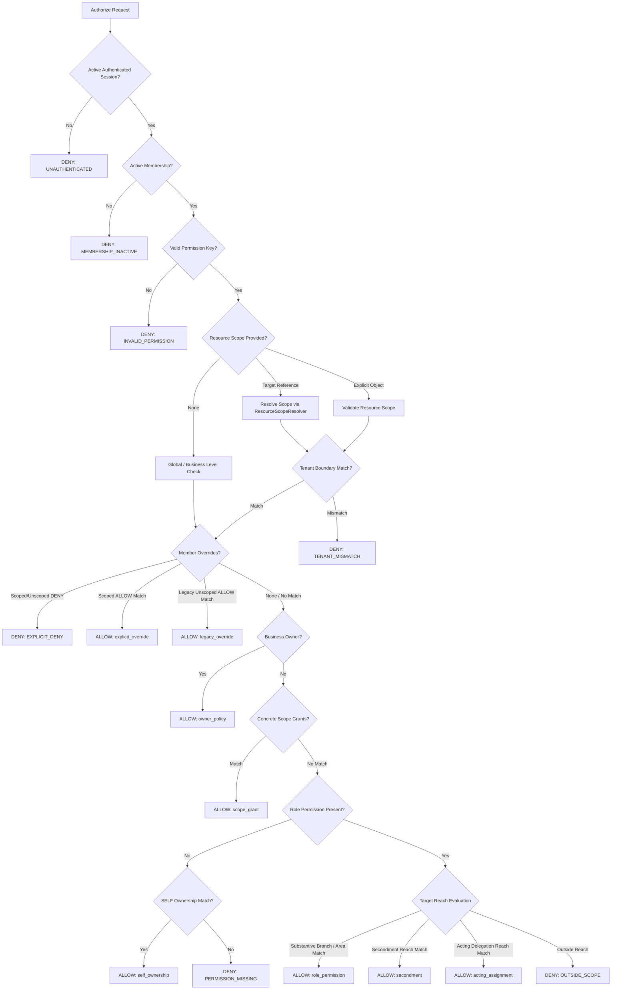

# Phase 30 Step 4: Central Authorization Policy Engine Specification

## Executive Summary

Phase 30 Step 4 delivers the centralized RBAC V2 Policy Decision Engine for WSNexa. The policy engine answers the foundational authorization question:

*Can this authenticated business user perform this permission against this trusted resource/scope right now?*

$$\text{AuthorizationContext} + \text{Requested Permission} + \text{Trusted Resource Scope} + \text{Overrides} + \text{Scope Grants} + \text{Assignment Reach} = \text{Decision}$$

---

## 1. Engine Architecture & Core Principles

The policy engine operates under six immutable golden rules:

1. **Permission = WHAT**: Fine-grained capability key (e.g. `orders.view`, `inventory.waste.record`).
2. **Scope = WHERE**: Bounded organizational domain (`ORGANIZATION`, `PROPERTY`, `DEPARTMENT`, `AREA_TEAM`, `SELF`).
3. **Context = TRUSTED FACTS**: Server-resolved identity, membership, and temporal assignments.
4. **Policy Engine = FINAL DECISION**: Evaluates context, permission, resource scope, and grants into a deterministic decision.
5. **Precedence = EXPLICIT DENY WINS**: An applicable explicit DENY override takes absolute precedence over role permissions, scope grants, and owner policy.
6. **Default Security Rule = DENY**: In the absence of explicit, unexpired authority covering the requested scope, access is denied (`OUTSIDE_SCOPE` or `PERMISSION_MISSING`).



---

## 2. Authorization Decision Schema & Reason Hierarchy

### Decision Object (`AuthorizationDecision`)
```typescript
interface AuthorizationDecision {
  allowed: boolean;
  permission: string;
  reason: AuthorizationDecisionReason;
  source: AuthorizationDecisionSource;
  matchedScope?: ScopeType | null;
  assignmentId?: string | null;
  overrideId?: string | null;
  grantId?: string | null;
  resourceScope?: ResourceScope | null;
  diagnostics?: {
    evaluatedAt: string;
    evaluationDurationMs: number;
  };
}
```

### Reason Codes (`AuthorizationDecisionReason`)
| Reason Code | Category | Explanation |
| :--- | :--- | :--- |
| `ALLOWED` | Allow | Authorized through valid authority rule |
| `UNAUTHENTICATED` | Boundary Deny | Missing session, unauthenticated caller |
| `TENANT_MISMATCH` | Boundary Deny | Resource belongs to a different business |
| `MEMBERSHIP_INACTIVE` | Boundary Deny | Membership suspended, inactive, or missing |
| `PERMISSION_MISSING` | Role Deny | Member lacks the requested capability |
| `EXPLICIT_DENY` | Override Deny | Member override explicitly revoked capability (top precedence) |
| `OUTSIDE_SCOPE` | Scope Deny | Member has capability, but target is outside authorized reach |
| `ASSIGNMENT_INACTIVE` | Scope Deny | Staff assignment is inactive |
| `ACTING_EXPIRED` | Temporal Deny | Acting delegation period has expired |
| `SECONDMENT_EXPIRED` | Temporal Deny | Secondment period has expired |
| `RESOURCE_NOT_FOUND` | Resolution Deny | Resource ID does not exist in database |
| `INVALID_RESOURCE_TYPE` | Resolution Deny | Unrecognized resource domain type |
| `OWNER_POLICY_DENIED` | Tenant Deny | Super-admin / platform permission attempted by tenant owner |
| `INVALID_PERMISSION` | Validation Deny | Permission key is not in canonical catalog or authoritative data |

---

## 3. Security Audit & Authority Semantics

### 3.1 Acting Authority Semantics
- **Reach vs. Permission**: An acting assignment (`staff_assignments` with `assignment_type = 'acting'`) grants **organizational reach** (`WHERE`), NOT permissions (`WHAT`).
- **No Job Title Permission Escalation**: An acting assignment covering a position or job title does **NOT** invent or grant permissions associated with that position's title.
- **Actor Possession Required**: The actor must already possess the requested permission through their own role permissions, overrides, or scope grants.
- **Limitation Documented**: Phase 30 does not model dynamic acting-position-specific role inheritance. An actor covering a General Manager position operates within the GM's branch/department reach using their own valid role permissions or explicit scope grants.

### 3.2 Secondment Semantics
- A secondment (`assignment_type = 'secondment'`) extends the member's operational property reach to a destination host branch.
- Secondments cannot invent missing permissions; they only provide property scope reach for permissions the user already possesses.
- Expired secondments are strictly excluded by temporal filters (`starts_at <= NOW <= ends_at`).

### 3.3 Platform Super Admin Isolation
- `context.isSuperAdmin = true` alone **MUST NOT** authorize any tenant or business permission.
- There are **zero** `isSuperAdmin` bypasses inside `policy-engine.ts`.
- Super Admin platform actions remain exclusively protected under the dedicated `requireSuperAdmin` platform path (`src/server/auth/super-admin.ts`).

### 3.4 Custom Permission Validation Mechanism
- Permission keys are strictly validated. An arbitrary string (even if prefixed with `custom_`) is rejected with `INVALID_PERMISSION` unless backed by authoritative database data (`context.rolePermissions`, `context.permissionOverrides`, or `context.scopeGrants`) or present in the 103 canonical keys catalog.

### 3.5 Precedence Hierarchy
1. **Unauthenticated / Inactive Membership** $\rightarrow$ `UNAUTHENTICATED` / `MEMBERSHIP_INACTIVE`
2. **Invalid Permission Key** $\rightarrow$ `INVALID_PERMISSION`
3. **Tenant Mismatch** $\rightarrow$ `TENANT_MISMATCH`
4. **Explicit DENY Override** $\rightarrow$ `EXPLICIT_DENY` (beats all allowances, owner policies, and grants)
5. **Explicit ALLOW Override** $\rightarrow$ `ALLOWED` (`source: explicit_override` / `legacy_override`)
6. **Business Owner Centralized Policy** $\rightarrow$ `ALLOWED` (`source: owner_policy`, `matchedScope: ORGANIZATION`)
7. **Concrete Scope Grants** $\rightarrow$ `ALLOWED` (`source: scope_grant`)
8. **Role Permissions Reach (Substantive, Secondment, Acting)** $\rightarrow$ `ALLOWED`
9. **SELF Ownership Fallback** $\rightarrow$ `ALLOWED` (`source: self_ownership`, `matchedScope: SELF`)
10. **Default Fallback** $\rightarrow$ `OUTSIDE_SCOPE` / `PERMISSION_MISSING`

---

## 4. Server-Side Guard Helpers

### `authorize(options: AuthorizeOptions): Promise<AuthorizationDecision>`
Primary evaluation method returning full diagnostics, reason codes, source, and timing.

### `can(options: CanOptions): Promise<boolean>`
Convenience wrapper returning boolean for conditional UI/server workflows.

### `requirePermission(options: RequirePermissionOptions): Promise<{ decision: AuthorizationDecision; context: AuthorizationContext }>`
Strict server action guard throwing `AuthorizationContextError` on denial.

```typescript
// Example Server Action Guard
export async function updateOrderAction(orderId: string, payload: UpdateOrderInput) {
  const { context, decision } = await requirePermission({
    permission: 'orders.update',
    resource: { type: 'order', id: orderId },
  });
  // Execute business logic with verified context
}
```

---

## 5. Verification & Test Suite Matrix

The engine is verified via `npm run verify:rbac-v2-engine` covering **83 automated assertions**:

| Section | Assertions | Result |
| :--- | :---: | :---: |
| 1. Tenant & Membership Boundaries | 11 | ✅ PASS |
| 2. Permission & Scope Evaluation | 17 | ✅ PASS |
| 3. Overrides Precedence & Semantics | 16 | ✅ PASS |
| 4. Business Owner Centralized Policy | 9 | ✅ PASS |
| 5. Acting, Secondments & Multi-Assignment | 14 | ✅ PASS |
| 6. SELF Authorization | 4 | ✅ PASS |
| 7. Resource Security & Error Handling | 12 | ✅ PASS |
| **Total Engine Verification** | **83** | **✅ 83 / 83 PASSED** |

### Complete Phase 30 Regression Results

| Suite | Command | Assertions | Result |
| :--- | :--- | :--- | :--- |
| RBAC V2 Policy Engine | `npm run verify:rbac-v2-engine` | 83 | ✅ 83/83 PASSED |
| Authorization Context | `npm run verify:rbac-v2-context` | 45 | ✅ 45/45 PASSED |
| RBAC V2 Schema & DB | `npm run verify:rbac-v2-schema` | 62 | ✅ 62/62 PASSED |
| Security Baseline | `npm run verify:phase30-security-baseline` | 35 | ✅ 35/35 PASSED |
| Permissions V2 | `npm run verify:permissions-v2` | 18 | ✅ 18/18 PASSED |
| Organization Architecture | `npm run verify:organization` | 119 | ✅ 119/119 PASSED |
| Orders RPC | `npm run verify:orders` | 17 | ✅ 17/17 PASSED |
| Payments POS | `npm run verify:payments` | 12 | ✅ 12/12 PASSED |
| Menu Modifiers | `npm run verify:modifiers` | 22 | ✅ 22/22 PASSED |
| Super Admin System | `npm run verify:super-admin` | 27 | ✅ 27/27 PASSED |
| TypeScript Compiler | `npx tsc --noEmit` | — | ✅ 0 Errors |
| ESLint | `npm run lint` | — | ✅ 0 Warnings / Errors |
| Next.js Production Build | `npm run build` | 169 Routes | ✅ Compiled Successfully |
| **Grand Total** | | **440 Assertions** | **✅ 100% PASS** |
