# WSNexa Phase 37 — Step 1: Navigation & Information Architecture Audit + Simplified UX Blueprint

## 1. Executive Summary

- **Core UX Principle**: *"Powerful underneath. Simple on the surface."* WSNexa provides enterprise-grade multi-branch hospitality management, yet a small café owner or single-location venue operator must understand where to click within **5 seconds** of landing.
- **Phase 37 Scope**: Product Simplification & User-Friendly Experience. This phase does **NOT** remove features, create a "Simple/Advanced" mode toggle, delete routes, delete permissions, or weaken RBAC v2. All underlying functionality remains 100% available and secure.
- **Step 1 Deliverable**: End-to-end audit of the current navigation and information architecture across all 38+ business workspace routes, complete route inventory, UX problem identification, role-aware findings, terminology mapping, hub page blueprints, and a streamlined 10-hub navigation architecture proposal for Step 2.

---

## 2. Current Navigation Architecture

WSNexa's tenant dashboard navigation is currently driven by a single canonical source of truth and resolved dynamically at runtime:

- **Canonical Navigation Config**: `CANONICAL_DASHBOARD_NAV_SECTIONS` in [`src/lib/navigation/dashboard-navigation.ts`](file:///c:/Users/x/.antigravity/wsnexa/src/lib/navigation/dashboard-navigation.ts).
- **Runtime Resolution Engine**: `resolveDashboardNavigation(context)` in [`src/server/navigation/navigation-engine.ts`](file:///c:/Users/x/.antigravity/wsnexa/src/server/navigation/navigation-engine.ts).
  - Evaluates: `Effective RBAC Permissions` + `Scope Context (ORG/PROPERTY/MIXED)` + `Feature Flags` = `Visible Navigation`.
- **Presentation Shells**:
  - Desktop Sidebar & Mobile Drawer: [`src/components/layout/dashboard-shell.tsx`](file:///c:/Users/x/.antigravity/wsnexa/src/components/layout/dashboard-shell.tsx).
  - Header & Branch Picker: [`src/components/layout/header.tsx`](file:///c:/Users/x/.antigravity/wsnexa/src/components/layout/header.tsx) & [`src/components/layout/active-branch-switcher.tsx`](file:///c:/Users/x/.antigravity/wsnexa/src/components/layout/active-branch-switcher.tsx).
  - Breadcrumb Navigation: [`src/components/layout/breadcrumbs.tsx`](file:///c:/Users/x/.antigravity/wsnexa/src/components/layout/breadcrumbs.tsx).
  - Super Admin Shell: [`src/app/admin/admin-navbar.tsx`](file:///c:/Users/x/.antigravity/wsnexa/src/app/admin/admin-navbar.tsx) (Platform Admin domain, separate from business workspace).

Currently, `CANONICAL_DASHBOARD_NAV_SECTIONS` exposes **10 top-level section headers** containing **38 individual primary sidebar links**.

---

## 3. Current Route / Feature Inventory

The following table catalogs all 38+ currently reachable routes in the business workspace:

| Current Label | Current Route | Section Header | Required Permission | Target Roles | Duplicated? | Terminology | Complexity | Proposed Hub Grouping |
| :--- | :--- | :--- | :--- | :--- | :--- | :--- | :--- | :--- |
| **Dashboard** | `/dashboard` | OVERVIEW | `orders.view` | All | Yes (Home) | Clear | Common | **Dashboard** |
| **Reports & Analytics** | `/dashboard/reports` | OVERVIEW | `reports.view` | Owner, Manager | No | Clear | Common | **Reports** |
| **Business Profile** | `/dashboard/business` | VENUE SETUP | `business.settings.manage` | Owner | No | Clear | Common | **Settings** |
| **Public Venue Profile** | `/dashboard/venue-profile` | VENUE SETUP | `venue_profile.manage` | Owner, Manager | No | Clear | Common | **Settings** |
| **Branches** | `/dashboard/branches` | VENUE SETUP | `branches.manage` | Owner | Yes (Picker) | Clear | Common | **Settings** |
| **Dining Setup** | `/dashboard/dining` | VENUE SETUP | `tables.manage` | Owner, Manager | Yes (Tables) | Clear | Common | **Dining & QR** |
| **Team & Members** | `/dashboard/team` | VENUE SETUP | `staff.view` | Owner, Manager | Yes (People) | Clear | Common | **Team** |
| **Staff Invitations** | `/dashboard/team/invites` | VENUE SETUP | `staff.invite` | Owner, Manager | Yes (Team) | Clear | Common | **Team** |
| **Organization Hub** | `/dashboard/organization` | ORG & PEOPLE | `organization.view` | Owner | Yes (Team) | Technical | Advanced | **Team (Org Sub-hub)** |
| **Structure & Units** | `/dashboard/organization/structure` | ORG & PEOPLE | `organization.view` | Owner | Yes (Org) | Technical | Advanced | **Team (Org Sub-hub)** |
| **Org Chart** | `/dashboard/organization/chart` | ORG & PEOPLE | `organization.view` | Owner | Yes (Org) | Technical | Advanced | **Team (Org Sub-hub)** |
| **Job Titles** | `/dashboard/organization/job-titles` | ORG & PEOPLE | `organization.view` | Owner | Yes (Org) | Technical | Advanced | **Team (Org Sub-hub)** |
| **Positions & Headcount** | `/dashboard/organization/positions` | ORG & PEOPLE | `positions.manage` | Owner | Yes (Org) | Technical | Advanced | **Team (Org Sub-hub)** |
| **People Directory** | `/dashboard/people` | ORG & PEOPLE | `people.view` | Owner, Manager | Yes (Team) | Clear | Common | **Team** |
| **Acting & Coverage** | `/dashboard/people/acting` | ORG & PEOPLE | `people.view` | Owner, Manager | No | Technical | Advanced | **Team** |
| **Secondments** | `/dashboard/people/secondments` | ORG & PEOPLE | `people.view` | Owner | No | Technical | Advanced | **Team** |
| **Integrity Diagnostics** | `/dashboard/people/integrity` | ORG & PEOPLE | `organization.view` | Owner | No | Technical | Advanced | **Team** |
| **Access Control Hub** | `/dashboard/access` | ACCESS & GOV | `roles.view` | Owner | Yes (Team) | Technical | Advanced | **Team (Access Sub-hub)** |
| **Roles & Templates** | `/dashboard/access/roles` | ACCESS & GOV | `roles.view` | Owner | Yes (Access) | Clear | Common | **Team (Access Sub-hub)** |
| **Scope Grants** | `/dashboard/access/scope-grants` | ACCESS & GOV | `roles.view` | Owner | Yes (Access) | Technical | Advanced | **Team (Access Sub-hub)** |
| **Access Diagnostics** | `/dashboard/access/diagnostics` | ACCESS & GOV | `roles.view` | Owner | Yes (Access) | Technical | Advanced | **Team (Access Sub-hub)** |
| **Menu Overview** | `/dashboard/menu` | MENU | `menu.view` | Owner, Manager | Yes (Items) | Clear | Common | **Menu** |
| **Categories** | `/dashboard/menu/categories` | MENU | `menu.categories.manage` | Owner, Manager | Yes (Menu) | Clear | Common | **Menu** |
| **Menu Items** | `/dashboard/menu/items` | MENU | `menu.view` | Owner, Manager | Yes (Menu) | Clear | Common | **Menu** |
| **Table Reservations** | `/dashboard/reservations` | OPERATIONS | `reservations.view` | Owner, Manager, Staff | No | Clear | Common | **Reservations** |
| **Cashier POS** | `/dashboard/cashier` | OPERATIONS | `cashier.access` | Cashier, Manager | No | Clear | Common | **Orders / POS** |
| **Kitchen Queue** | `/dashboard/kitchen` | OPERATIONS | `kitchen.access` | Kitchen, Manager | No | Clear | Common | **Orders / Kitchen** |
| **Waiter Assistance** | `/dashboard/waiter` | OPERATIONS | `waiter.requests.view` | Waiter, Manager | No | Clear | Common | **Orders / Waiter** |
| **Waiter Menu** | `/dashboard/waiter/menu` | OPERATIONS | `waiter.orders.create` | Waiter, Manager | Yes (Waiter) | Clear | Common | **Orders / Waiter** |
| **Inventory Hub** | `/dashboard/inventory` | INVENTORY | `inventory.view` | Owner, Manager | Yes (Items) | Clear | Common | **Operations** |
| **Stock Items** | `/dashboard/inventory/items` | INVENTORY | `inventory.view` | Owner, Manager | Yes (Inv) | Clear | Common | **Operations** |
| **Stock Counts** | `/dashboard/inventory/counts` | INVENTORY | `inventory.counts.manage` | Owner, Manager | Yes (Inv) | Clear | Common | **Operations** |
| **Waste Tracking** | `/dashboard/inventory/waste` | INVENTORY | `inventory.waste.record` | Owner, Manager | Yes (Inv) | Clear | Common | **Operations** |
| **Stock Transfers** | `/dashboard/inventory/transfers` | INVENTORY | `inventory.transfers.manage` | Owner, Manager | Yes (Inv) | Clear | Common | **Operations** |
| **Storage Locations** | `/dashboard/inventory/locations` | INVENTORY | `inventory.locations.manage` | Owner, Manager | Yes (Inv) | Clear | Common | **Operations** |
| **Recipes & Costing** | `/dashboard/inventory/recipes` | INVENTORY | `inventory.view` | Owner, Manager | Yes (Inv) | Clear | Common | **Operations** |
| **Purchasing & Suppliers** | `/dashboard/inventory/purchasing` | INVENTORY | `inventory.view` | Owner, Manager | Yes (Inv) | Clear | Common | **Operations** |
| **Guest CRM** | `/dashboard/customers` | GROWTH & GUESTS | `customers.view` | Owner, Manager | No | Clear | Common | **Customers** |
| **Customer Reviews** | `/dashboard/reviews` | GROWTH & GUESTS | `reviews.respond` | Owner, Manager | No | Clear | Common | **Customers** |
| **Reputation & Rankings** | `/dashboard/reputation` | GROWTH & GUESTS | `reputation.view` | Owner, Manager | Yes (Reviews) | Technical | Advanced | **Customers** |
| **Loyalty & Rewards** | `/dashboard/loyalty` | GROWTH & GUESTS | `loyalty.view` | Owner, Manager | No | Clear | Common | **Customers** |
| **Subscription & Billing** | `/dashboard/settings/subscription` | SETTINGS | `business.settings.manage` | Owner | No | Clear | Common | **Settings** |
| **Order Security** | `/dashboard/settings/order-security` | SETTINGS | `order_security.manage` | Owner | No | Technical | Advanced | **Settings** |
| **Payment Methods** | `/dashboard/settings/payments` | SETTINGS | `branches.manage` | Owner, Manager | No | Clear | Common | **Settings** |
| **Help Center** | `/dashboard/help` | SUPPORT | None | All | No | Clear | Common | **Settings / Help** |

---

## 4. Role-Aware Navigation Findings

Audit of visible navigation and landing paths per role:

1. **Business Owner**:
   - Sees all 10 primary navigation hub items.
   - **Improvement**: Sidebar density reduced from 38 links down to 10 clear, discoverable hubs.
2. **Branch Manager**:
   - Sees primary hubs permitted by active RBAC permissions (Dashboard, Orders, Menu, Dining & QR, Reservations, Customers, Operations, Team, Reports, Settings).
3. **Cashier**:
   - `cashier.access` grants access to Cashier POS (`/dashboard/cashier`).
   - **Direct Workflow**: Cashiers land directly on `/dashboard/cashier`. They do **NOT** navigate through an Owner-oriented hub.
4. **Kitchen Staff**:
   - `kitchen.access` grants access to Kitchen Queue (`/dashboard/kitchen`).
   - **Direct Workflow**: Kitchen Staff land directly on `/dashboard/kitchen`. Zero unnecessary clicks.
5. **Waiter**:
   - `waiter.requests.view` & `waiter.orders.create` grant access to Waiter Assistance & Menu (`/dashboard/waiter`).
   - **Direct Workflow**: Waiters land directly on `/dashboard/waiter`.
6. **Custom Roles**:
   - Resolved dynamically via `resolveDashboardNavigation(context)`.
   - **Rule**: Parent hubs will appear in the sidebar **only** if the custom role possesses permission for at least one child destination within that hub.

---

## 5. UX Problems Found

### A. Sidebar Overload
- 38 links across 10 uppercase headers cause extreme vertical scrolling on desktop and mobile.
- A user trying to quickly find "Tables" or "Recipes" must scan through 38 text labels.

### B. Fragmented Feature Families
- **People & HR**: Split across 3 separate sections (`VENUE SETUP`, `ORGANIZATION & PEOPLE`, `ACCESS & GOVERNANCE`) containing 15 distinct links.
- **Inventory & Supply**: 8 individual links listed in the main sidebar (`Stock Items`, `Stock Counts`, `Waste Tracking`, `Stock Transfers`, `Storage Locations`, `Recipes`, `Purchasing`).
- **Dining Setup**: `Dining Setup` in `VENUE SETUP`, but Table Reservations in `OPERATIONS`, and Tables/Areas/QR managed under separate subroutes.

### C. Enterprise Terminology Exposed Too Early
- Small café operators see enterprise terms like `Positions & Headcount`, `Scope Grants`, `Integrity Diagnostics`, `Secondments`, `Acting & Coverage`, and `Order Security` directly in their primary sidebar.

### D. Duplicate Navigation CTAs
- `Team & Members` vs `People Directory` vs `Organization Hub`.
- `Dining Setup` vs `/dashboard/tables` vs `/dashboard/areas` vs `/dashboard/tables/qr`.
- `Inventory Hub` vs 7 individual inventory subroute links.

### E. Mobile Navigation Density
- On mobile devices, 38 sidebar items require multiple full-screen scrolls inside the mobile drawer, with small touch targets and bad text wrapping on smaller screens.

---

## 6. Duplicate / Fragmented Navigation

| Feature Area | Fragmented Locations | Proposed Consolidated Canonical Location |
| :--- | :--- | :--- |
| **Dining & Tables** | `VENUE SETUP` $\rightarrow$ Dining Setup<br>`OPERATIONS` $\rightarrow$ Table Reservations<br>Subroutes: `/dashboard/tables`, `/dashboard/areas`, `/dashboard/tables/qr` | **Dining & QR Hub** (`/dashboard/dining`) containing Tables, Service Areas, QR Codes, and Reservations link. |
| **People & Team** | `VENUE SETUP` $\rightarrow$ Team & Members, Staff Invitations<br>`ORG & PEOPLE` $\rightarrow$ Org Hub, Structure, Org Chart, Job Titles, Positions, People Directory, Acting, Secondments, Integrity<br>`ACCESS & GOV` $\rightarrow$ Access Hub, Roles, Scope Grants, Diagnostics | **Team Workspace** (`/dashboard/team` as canonical route):<br>Default View: **Staff & Members**<br>Sub-groups: **Access & Roles**, **Organization** |
| **Inventory & Purchasing** | `INVENTORY` section with 8 separate sidebar links (`Items`, `Counts`, `Waste`, `Transfers`, `Locations`, `Recipes`, `Purchasing`) | **Operations Workspace** (`/dashboard/inventory` as canonical route):<br>Sub-groups: **Inventory**, **Food Costing**, **Supply** |
| **Customers & Reviews** | `GROWTH & GUESTS` section with 4 separate links (`Guest CRM`, `Customer Reviews`, `Reputation`, `Loyalty`) | **Customers Workspace** (`/dashboard/customers` as canonical route):<br>Default View: **Customer Directory**<br>Sub-views: **Reviews**, **Reputation**, **Loyalty** |

---

## 7. Terminology Audit

| Current Term | Proposed User-Friendly Term | Rationale |
| :--- | :--- | :--- |
| **CANONICAL_DASHBOARD_NAV_SECTIONS** (38 links) | **Streamlined 10 Primary Hubs** | Reduces cognitive overload from 38 sidebar links down to 10 primary items. |
| **Positions & Headcount** | **Positions** | "Headcount" is enterprise HR jargon; "Positions" is clear and concise. |
| **Scope Grants** | **Scoped Permissions** | "Scope Grants" is internal RBAC v2 terminology; "Scoped Permissions" explains what it does. |
| **Integrity Diagnostics** | **Data Integrity Check** | Human-readable system health descriptor. |
| **Guest CRM** | **Customers** | "CRM" is sales software terminology; "Customers" is universal for hospitality. |
| **Reputation & Rankings** | **Reputation & Scores** | Clearer and less academic. |
| **Order Security** | **Order Security & PINs** | Explains that it controls POS security PINs and authorization thresholds. |
| **GRACE_PERIOD** | **Grace Period** | Proper title casing for human presentation. |
| **SUSPENDED** | **Suspended** | Proper title casing for human presentation. |

---

## 8. Mobile Navigation Findings

1. **Current Mobile Drawer**:
   - Renders all 38 links in a single vertical scroll container.
   - Requires excessive scrolling ($\sim 3-4$ full screens) to reach bottom items like Settings or Help.
   - Touch targets for nested sub-items are $36\text{px}$ high, below the recommended $44\text{px}$ touch target threshold.
2. **Step 2 Mobile Strategy**:
   - Render the 10 primary hubs in the mobile drawer.
   - Tapping a hub expands a clean accordion or navigates directly to the hub page where secondary actions are presented as full-width touch cards ($44\text{px}+$ height).

---

## 9. Final Proposed Main Navigation

The proposed primary navigation for the business workspace consists of **10 primary items**:

```
1.  📊 Dashboard      (/dashboard)
2.  🍽️ Orders         (/dashboard/cashier, /dashboard/kitchen, /dashboard/waiter)
3.  📜 Menu           (/dashboard/menu)
4.  🪑 Dining & QR    (/dashboard/dining)
5.  📅 Reservations   (/dashboard/reservations)
6.  👥 Customers      (/dashboard/customers)
7.  📦 Operations     (/dashboard/inventory)
8.  👨‍💼 Team           (/dashboard/team)
9.  📈 Reports        (/dashboard/reports)
10. ⚙️ Settings       (/dashboard/settings)
```

---

## 10. Feature-to-Hub Mapping

```mermaid
graph TD
    Nav[WSNexa Workspace Navigation] --> D[1. Dashboard]
    Nav --> O[2. Orders]
    Nav --> M[3. Menu]
    Nav --> Di[4. Dining & QR]
    Nav --> R[5. Reservations]
    Nav --> C[6. Customers]
    Nav --> Op[7. Operations]
    Nav --> T[8. Team]
    Nav --> Rep[9. Reports]
    Nav --> S[10. Settings]

    O --> Cashier[Cashier POS /dashboard/cashier]
    O --> Kitchen[Kitchen Queue /dashboard/kitchen]
    O --> Waiter[Waiter Service /dashboard/waiter]

    M --> MenuOverview[Menu Overview /dashboard/menu]
    M --> Categories[Categories /dashboard/menu/categories]
    M --> Modifiers[Modifiers /dashboard/menu/items]

    Di --> Tables[Table Layout /dashboard/tables]
    Di --> Areas[Service Areas /dashboard/areas]
    Di --> QR[QR Codes /dashboard/tables/qr]

    C --> Directory[Guest Directory /dashboard/customers]
    C --> Reviews[Reviews & Feedback /dashboard/reviews]
    C --> Reputation[Reputation & Scores /dashboard/reputation]
    C --> Loyalty[Loyalty & Rewards /dashboard/loyalty]

    Op --> InvGroup[Inventory: Items, Counts, Waste, Transfers, Locations]
    Op --> CostingGroup[Food Costing: Recipes]
    Op --> SupplyGroup[Supply: Purchasing, Suppliers]

    T --> PeopleGroup[People: Staff, Invites, People Directory]
    T --> AccessGroup[Access: Roles, Scoped Permissions]
    T --> OrgGroup[Organization: Structure, Org Chart, Positions]

    Rep --> ReportsDash[Reports & Analytics /dashboard/reports]

    S --> BusinessProfile[Business Profile /dashboard/business]
    S --> VenueProfile[Public Venue Profile /dashboard/venue-profile]
    S --> Branches[Branches /dashboard/branches]
    S --> Subscription[Subscription & Billing /dashboard/settings/subscription]
    S --> OrderSecurity[Order Security & PINs /dashboard/settings/order-security]
    S --> Payments[Payment Methods /dashboard/settings/payments]
    S --> Help[Help Center /dashboard/help]
```



---

## 11. Hub Route Collision Resolutions & Workspace Blueprints

### A. Customers Workspace (`/dashboard/customers`)
- **Collision Resolution**: Retain `/dashboard/customers` as the canonical route. Evolve the existing page into a unified Customers workspace hub rather than adding an extra navigation level.
- **Default View**: Customer Directory remains immediately usable upon opening `/dashboard/customers`.
- **Secondary Views**: Exposed via clean top tabs or sub-cards:
  - `Customer Directory` (`/dashboard/customers` - Default)
  - `Reviews & Feedback` (`/dashboard/reviews`)
  - `Reputation & Scores` (`/dashboard/reputation`)
  - `Loyalty Program` (`/dashboard/loyalty`)
- **Permissions**: Requires `customers.view` or `reviews.respond`.

### B. Team Workspace (`/dashboard/team`)
- **Collision Resolution**: Retain `/dashboard/team` as the canonical route. Evolve the existing page into the Team workspace. Staff management remains the default view.
- **Preventing Card-Grid Overload**: Group features into 3 structured sub-sections:
  - **People Sub-group**: Staff Members (`/dashboard/team`), Staff Invitations (`/dashboard/team/invites`), People Directory (`/dashboard/people`).
  - **Access Sub-group**: Roles & Permissions (`/dashboard/access/roles`), Scoped Permissions (`/dashboard/access/scope-grants`).
  - **Organization Sub-group**: Organization Structure (`/dashboard/organization/structure`), Org Chart (`/dashboard/organization/chart`), Positions (`/dashboard/organization/positions`).
- **Advanced Tools**: Acting & Coverage (`/dashboard/people/acting`), Secondments (`/dashboard/people/secondments`), and Integrity Diagnostics (`/dashboard/people/integrity`) remain reachable via secondary tabs/drawers without cluttering the main screen.

### C. Operations Workspace (`/dashboard/inventory`)
- **Collision Resolution**: Retain `/dashboard/inventory` as the canonical route for Operations.
- **Sub-grouping Structure**:
  - **Inventory**: Stock Items (`/dashboard/inventory/items`), Stock Counts (`/dashboard/inventory/counts`), Waste Tracking (`/dashboard/inventory/waste`), Stock Transfers (`/dashboard/inventory/transfers`), Storage Locations (`/dashboard/inventory/locations`).
  - **Food Costing**: Recipes & Costing (`/dashboard/inventory/recipes`).
  - **Supply**: Purchasing & Suppliers (`/dashboard/inventory/purchasing`).

### D. Dining & QR Hub (`/dashboard/dining`)
- **Title**: Dining & QR Setup
- **Child Destinations**: Tables (`/dashboard/tables`), Service Areas (`/dashboard/areas`), QR Codes (`/dashboard/tables/qr`), Reservations link (`/dashboard/reservations`).

---

## 12. Route Preservation Statement

- **URL Preservation**: All 38+ existing Next.js page route URLs remain 100% active, intact, and reachable.
- **Server Authorization Preservation**: Every route handler and server action preserves strict server-side RBAC v2, tenant isolation (`business_id`), branch scope, subscription lifecycle, and platform suspension checks.
- **Deep-Link Behavior**: Direct bookmarks and external links (e.g. `/dashboard/inventory/recipes`, `/dashboard/access/roles/[roleId]`) continue to function without breaking.
- **Page Composition Evolution**: Page presentation and sub-navigation are consolidated during Phase 37 to improve discoverability without deleting routes or introducing breaking relocations.

---

## 13. RBAC / Security Guardrails

- **Navigation is Presentation, NOT Authorization**: Hiding a navigation item does not secure a route. All server actions and API route handlers continue enforcing strict server-side RBAC v2, tenant isolation (`business_id`), branch scope, subscription lifecycle, and platform suspension.
- **Hub Permission Logic**: A parent hub is rendered in the sidebar **only** if the user possesses permission to access at least one child destination within that hub.

---

## 14. Dashboard Audit Notes

Recommendation for Step 3 (Dashboard Simplification):
- **KEEP**: Daily Sales & Order Overview, Operational Realtime Status, Active Subscription Banner.
- **SIMPLIFY**: Quick Action Buttons (limit to top 4 actions: New Order, Add Menu Item, Manage Tables, Invite Staff).
- **MOVE TO HUBS**: Deep diagnostic metrics and secondary enterprise HR widgets.
- **ROLE-SPECIFIC LANDING**:
  - Kitchen Staff land on `/dashboard/kitchen`.
  - Cashiers land on `/dashboard/cashier`.
  - Waiters land on `/dashboard/waiter`.

---

## 15. Phase 37 Step 2 Implementation Plan

1. **Update `CANONICAL_DASHBOARD_NAV_SECTIONS`**:
   - Refactor `src/lib/navigation/dashboard-navigation.ts` to expose the 10 primary items.
2. **Evolve Workspace Hub Components**:
   - Update `/dashboard/team`, `/dashboard/inventory`, `/dashboard/customers`, and `/dashboard/dining` with structured sub-group navigation (People, Access, Org / Inventory, Food Costing, Supply).
3. **Verify Navigation Engine**:
   - Verify `resolveDashboardNavigation` dynamically resolves the 10 primary items based on child permission availability.
4. **Mobile Navigation Refinement**:
   - Ensure mobile drawer renders $44\text{px}+$ touch targets and clean accordions.
5. **Run Automated Verification**:
   - Run Phase 31 Navigation IA test suite, TypeScript check, ESLint, and Next.js build.

---

## 16. Risks / Unresolved Decisions

1. **Route-to-Hub Composition Compatibility**: Evolving `/dashboard/team` and `/dashboard/customers` in-place must maintain full backwards compatibility with existing props and server components.
2. **Permission-Aware Parent Hub Visibility**: A parent hub must strictly collapse if a custom role has zero child permissions within that hub.
3. **Avoiding Card-Grid Overload**: Hub pages must use clean sub-groups (e.g. People, Access, Org) rather than dumping 15 giant cards onto a single page.
4. **Preserving Direct Operational Workflows**: Kitchen Staff, Cashiers, and Waiters must land directly on their operational page without passing through an owner hub.
5. **Mobile Touch Target Spacing**: Mobile drawer must ensure $44\text{px}+$ tap targets to prevent mis-taps on small screens.
6. **Deep Link Preservation**: All dynamic detail views (e.g. `/dashboard/access/roles/[roleId]`, `/dashboard/inventory/counts/[id]`) must remain 100% accessible via direct URL.

---

## 17. Manual UX Review Checklist

- [ ] **5-Second Clarity Check**: Can a new café owner locate "Menu Items", "Table Setup", "Reports", and "Staff Members" within 5 seconds?
- [ ] **Sidebar Density**: Are there exactly 10 primary items visible in the main sidebar?
- [ ] **Operational Staff Landing**: Does Kitchen Staff land directly on `/dashboard/kitchen`? Does Cashier land on `/dashboard/cashier`?
- [ ] **Mobile Touch Targets**: Are all mobile drawer navigation items $\ge 44\text{px}$ high?
- [ ] **Deep Links**: Do direct links to `/dashboard/inventory/recipes` and `/dashboard/access/roles` load cleanly?

---

## 18. Phase 37 Step 1 Status

**READY FOR BLUEPRINT REVIEW**
