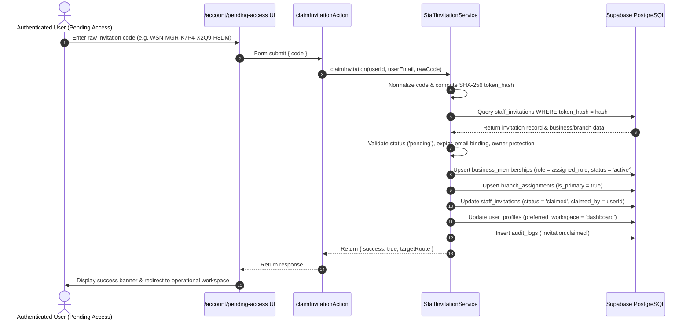

# WSNexa Staff Invitation Claim Sequence

```mermaid
sequenceDiagram
    autonumber
    actor User as Authenticated User (Pending Access)
    participant UI as /account/pending-access UI
    participant Action as claimInvitationAction
    participant Service as StaffInvitationService
    participant DB as Supabase PostgreSQL

    User->>UI: Enter raw invitation code (e.g. WSN-MGR-K7P4-X2Q9-R8DM)
    UI->>Action: Form submit { code }
    Action->>Service: claimInvitation(userId, userEmail, rawCode)
    Service->>Service: Normalize code & compute SHA-256 token_hash
    Service->>DB: Query staff_invitations WHERE token_hash = hash
    DB-->>Service: Return invitation record & business/branch data
    Service->>Service: Validate status ('pending'), expiry, email binding, owner protection
    Service->>DB: Upsert business_memberships (role = assigned_role, status = 'active')
    Service->>DB: Upsert branch_assignments (is_primary = true)
    Service->>DB: Update staff_invitations (status = 'claimed', claimed_by = userId)
    Service->>DB: Update user_profiles (preferred_workspace = 'dashboard')
    Service->>DB: Insert audit_logs ('invitation.claimed')
    Service-->>Action: Return { success: true, targetRoute }
    Action-->>UI: Return response
    UI->>User: Display success banner & redirect to operational workspace
```
